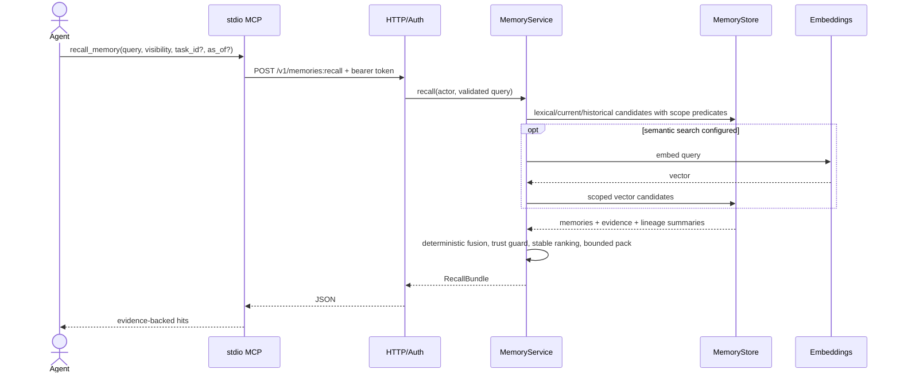

# Swarm Brain v0 architecture

This document turns the design in [issue #1](issue-1.md) into a bounded,
self-contained system under `swarm-brain/`. Swarm Brain does not import `sen`
or `mnemotree` at runtime. It adapts audited ideas from both and owns all new
coordination, identity, CockroachDB, HTTP, and MCP code.

## Decision and implementation boundary

The architectural formula is:

```text
Swarm Brain
= mnemotree's small async/protocol/transport patterns
+ sen's source, bitemporal, supersession, and conservative-policy semantics
+ a new CockroachDB-native coordination kernel
```

The boundary is deliberately narrower than either donor:

| Area | v0 decision | Current implementation boundary |
| --- | --- | --- |
| Domain contracts | Focused Pydantic v2 models; no `MemoryItem` god-object | Strict models exist in `domain/{common,agents,tasks,leases,memory,evidence,conflicts,events}.py`; storage-neutral async protocols exist in `ports/`. Tests generate schemas for every discovered domain model, require idempotency on mutations, reject auth-owned/extra/invalid fields, normalize UUIDs, and verify that `InMemoryKernel` satisfies the core runtime ports. |
| Coordination | New task DAG, lease, checkpoint, handoff, and idempotency services | Capability-gated services/port and lock-serialized `InMemoryKernel` operations exist. Deterministic tests prove 12-to-4 claims, dependency block/unblock, one event/outbox for duplicate completion, crash handoff, and stale-owner fencing locally. The adapter also validates task associations, same-scope dependencies, and scoped checkpoint/completion memory references. Distributed/durable behavior awaits a Cockroach repository/integration test. |
| Memory | New scoped memory service preserving source lineage and bitemporal history | `MemoryService`, `ConservativeMemoryPolicy`, ports, and process-local remember/recall/lineage/source-review behavior exist. Tests prove cross-agent reuse, supersession/history, poisoning resistance, source-rejection rollback, fail-closed repository recall/lineage, and rejection of unregistered or mismatched evidence references; Cockroach persistence remains unimplemented. |
| Conflicts | New evidence-backed report/resolve workflow | Domain/service/port/table and process-local behavior exist; a deterministic test proves evidence-backed winner/loser state. Cockroach conflict persistence remains unimplemented. |
| Audit/events | Append-only event/outbox contracts plus capability-gated reads | `AuditService`, event/audit/outbox domain contracts, ports, and in-memory event/metric views exist. The HTTP vertical slice proves event/metric reads and one canonical completion event/outbox row; a durable relay remains P1. |
| Auth | Auth-derived identity for bearer and later IAM | A signed short-lived HMAC run-token codec and FastAPI bearer dependency derive the scoped actor and reject missing, invalid, expired, or forged identity input. Focused HTTP tests cover this local path; database-backed revocation/token lookup remains planned. |
| CockroachDB | Canonical P1 durable store; short `SERIALIZABLE` units and transactional outbox | `adapters/cockroach/schema.sql`, its non-applying resource reader, and `retry.py` exist, with focused schema/retry tests. No Cockroach repository is composed in P0; a table in DDL is not evidence that a repository operation or durable API path exists. |
| HTTP | Canonical API for MCP, AgentCore, and dashboard | An authenticated FastAPI factory implements typed request/response models, canonical routes, replay headers, and the error envelope over the in-memory runtime. Tests cover auth/scope/replay/OpenAPI and a full in-memory vertical slice across all canonical routes. Revocation-backed auth and Cockroach composition remain unimplemented. |
| MCP | Six thin model-visible tools over HTTP; runtime-owned renewal | The stdio server registers exactly six scope-safe functions over an aligned async HTTP client. Tests prove the tool set/schema, field/header/version translation, and automatic lease renewal against fake HTTP without a model call. A real stdio process/lifespan test remains absent. |
| Hybrid extraction | Deterministic extraction first, optional model extraction second, policy gate before write | Planned; no model provider is required for P0 correctness. |

This table is intentionally conservative: design, DDL, or a declared script
entry point does not by itself count as implemented behavior.
At this snapshot 32 checked-in tests cover strict domain contracts/ports,
CockroachDB schema/retry, ten deterministic in-memory acceptance scenarios,
signed-token and full canonical in-memory HTTP behavior, typed OpenAPI, and MCP
schema/HTTP translation plus automatic renewal. Real stdio execution, live
CockroachDB, Cockroach repositories, and restart durability remain unproven.

## Context and trust boundaries

```mermaid
flowchart LR
    Agent["Coding agent\nClaude / Codex / Gemini / Qwen"]
    Bridge["Local stdio MCP bridge\ncredentials + automatic renewal"]
    API["HTTPS API\nauth + Pydantic validation"]
    App["Application services\ncoordination / memory / conflict / audit"]
    Ports["Typed ports"]
    CRDB["CockroachDB\nsource + state + outbox"]
    Worker["Outbox / embedding / extraction workers"]
    Artifact["Artifact and model adapters"]

    Agent -->|"six tools; no identity fields"| Bridge
    Bridge -->|"run-scoped bearer token"| API
    API -->|"ActorContext + command"| App
    App --> Ports
    Ports --> CRDB
    CRDB --> Worker
    Worker --> Artifact
```



The stdio bridge reads `SWARMBRAIN_API_URL` and
`SWARMBRAIN_AGENT_TOKEN`. It may accept a locally configured expected run or
agent identifier as a misconfiguration check, but it never forwards a model-
supplied identity. The HTTPS authenticator resolves the token hash to exactly
one active token/agent/run and creates `ActorContext`. It derives
`tenant_id`, `project_id`, `repository_id`, `swarm_id`, `run_id`, `agent_id`,
harness/provider/model metadata, and capabilities from authenticated state.

Path identifiers and command resource identifiers are selectors, not
identity. A path `run_id` must equal `ActorContext.run_id`; task, lease, memory,
and conflict rows must belong to the authenticated tenant/repository/run. A
mismatch is `403 scope_mismatch`, not a request to switch identity. The six MCP
schemas contain no tenant, repository, run, agent, or capability fields.

For the stdio MVP there is no OAuth flow. Bearer tokens are short-lived,
run-scoped, stored only as hashes, and supplied through the local environment.
AgentCore may use a separate IAM/SigV4 authenticator that produces the same
`ActorContext`. A future public Streamable HTTP MCP endpoint may add OAuth
without changing application contracts.

## Package and dependency direction

The intended package shape is:

```text
swarm-brain/src/swarmbrain/
├── domain/                  # Pydantic values, commands, results, events
│   ├── agents.py
│   ├── tasks.py
│   ├── leases.py
│   ├── memory.py
│   ├── evidence.py
│   ├── conflicts.py
│   └── events.py
├── application/             # use cases; no transport or driver types
│   ├── coordination.py
│   ├── memory_service.py
│   ├── handoff.py
│   ├── conflict_service.py
│   └── audit.py
├── ports/                   # narrow async protocols
│   ├── coordination_store.py
│   ├── memory_store.py
│   ├── embeddings.py
│   ├── artifacts.py
│   └── event_sink.py
├── adapters/
│   ├── cockroach/           # DDL/resource reader + retry now; repositories in P1
│   ├── memory/              # deterministic in-memory test adapter
│   ├── bedrock/
│   ├── s3/
│   └── auth/
├── transports/
│   ├── http/                # FastAPI mapping only
│   └── mcp/                 # six stdio tools, HTTP client
└── cli/
```

Dependencies point inward: transports and adapters depend on application
ports and domain contracts; application services depend on ports and domain;
domain depends only on Pydantic and the standard library. CockroachDB rows,
FastAPI request objects, MCP objects, and provider SDK values do not cross into
application service signatures. The actual tree may consolidate a small v0
module, but it must preserve this dependency direction.

Coordination and memory remain separate application concerns. A claim may ask
the memory service for an initial bundle, but the coordination store does not
perform retrieval or ranking. MCP remains a translation layer rather than a
second application layer.

## Temporal memory and policy

Every accepted publication preserves its source or evidence references. A
memory has two time axes:

- world time `[valid_from, valid_to)`, describing when the statement is true;
- system time `[recorded_from, recorded_to)`, describing when Swarm Brain
  considered that row current.

When present, each interval end is strictly greater than its start. A current
memory has no `recorded_to`.

An update is append-only:

```text
insert replacement
+ replacement.supersedes_id = previous.id
+ previous.superseded_by_id = replacement.id
+ previous.state = superseded
+ previous.recorded_to = transaction timestamp
+ supersedes link + swarm event + outbox event
```

These writes happen in one serializable transaction. Historical recall selects
the system-time and world-time intervals explicitly; ordinary recall selects
`recorded_to IS NULL` and excludes `refuted` and `superseded`. Source rejection
does not erase history: it marks the source rejected/untrusted and retracts or
supersedes currently derived state in the same audited transaction.

Policy operations are `add`, `update`, `merge`, `delete`, and `noop`, but
`delete` means an auditable tombstone/refutation, never destructive loss of
lineage. Exact normalized duplicates may merge. Semantic similarity alone
cannot merge statements whose critical tokens, scope, temporal interval, or
evidence disagree.

Memory-poisoning guards are enforced after retrieval predicates and before a
write:

- model output is untrusted input validated into `extra="forbid"` contracts;
- tentative unsupported memory cannot supersede confirmed evidence-backed
  memory;
- confirm, refute, and resolve require explicit capabilities;
- scope/state/trust predicates execute in the repository query, not as
  post-retrieval filtering;
- source rejection is fail-closed for ordinary recall;
- every mutation is bound to authenticated context and an idempotency key.

## Hybrid extraction

Extraction is an optional producer of `RememberCommand`, not an authority over
stored state.

1. Persist a source and its digest/occurrence identity.
2. Run deterministic local routing for structured signals such as test output,
   commit/file references, task checkpoints, decisions, attempts, and outcomes.
3. If configured, run a lazy local or remote model router, then a focused
   extractor. Blocking local inference runs off the event loop.
4. Validate each candidate against Pydantic contracts and attach source spans,
   evidence, extractor/model identity, and confidence.
5. Apply deterministic policy and poisoning guards. Model confidence never
   grants confirm/refute/resolve capability.
6. Commit accepted source, memory, evidence, lineage, audit, and outbox rows in
   one transaction. Generate embeddings asynchronously from the outbox; lexical
   recall remains correct without them.
7. On unavailable/invalid model output, retain the source and deterministic
   candidates. Do not silently invent a memory or fail the source write.

P0 therefore has no paid-provider dependency. Provider-backed extraction and
quality evaluation belong to P1/P2 and require explicit configuration.

## Sequences

### Claim with initial context

```mermaid
sequenceDiagram
    actor A as Agent
    participant M as stdio MCP
    participant H as HTTP/Auth
    participant C as CoordinationService
    participant DB as CockroachStore
    participant R as MemoryService

    A->>M: claim_task(selector, idempotency_key)
    M->>H: POST /v1/tasks:claim + bearer token
    H->>H: derive ActorContext; reject supplied identity
    H->>C: claim(actor, command)
    C->>DB: SERIALIZABLE transaction
    DB->>DB: lock idempotency key; replay or validate request hash
    DB->>DB: expire elapsed leases; select eligible dependency-ready task
    DB->>DB: atomically insert active lease + update task + event + outbox
    DB-->>C: task, lease, committed response
    C->>R: recall handoff/task/run/repository context
    R->>DB: scoped current read
    DB-->>R: latest checkpoint + RecallBundle
    R-->>C: initial context
    C-->>H: ClaimTaskResult
    H-->>M: JSON
    M-->>A: task + lease + initial context
```

The unique partial index is the last-line invariant for one active lease per
task; transaction predicates and retries make it useful under 12 racing
workers. Initial context is part of the claim response so the model does not
need an immediate second tool call.

### Recall



The store, not the model or transport, enforces visibility. Repository scope
predicates include tenant/repository plus task or run visibility rules. Default
recall cannot return refuted, superseded, rejected-source, or future-recorded
rows.

### Checkpoint

```mermaid
sequenceDiagram
    actor A as Agent
    participant M as stdio MCP
    participant H as HTTP/Auth
    participant S as HandoffService
    participant DB as CoordinationStore

    A->>M: checkpoint_task(task_id, lease_id, version, summary, ...)
    M->>H: POST /v1/tasks/{task_id}/checkpoints
    H->>S: checkpoint(actor, command)
    S->>DB: SERIALIZABLE transaction
    DB->>DB: replay/validate idempotency record
    DB->>DB: lock task + lease; verify owner, version, active, unexpired
    DB->>DB: allocate next sequence; insert checkpoint
    DB->>DB: append handoff memory + swarm event + outbox; complete idempotency row
    DB-->>S: stable CheckpointResult
    S-->>H: result
    H-->>M: JSON
    M-->>A: checkpoint id + sequence
```

### Crash handoff

```mermaid
sequenceDiagram
    actor A as Agent A
    participant RA as Runtime A
    participant DB as CockroachStore
    actor B as Agent B
    participant RB as Runtime B

    A->>RA: checkpoint_task(...)
    RA->>DB: committed checkpoint
    Note over A,RA: process crashes; automatic renewals stop
    Note over DB: lease expires by database time
    B->>RB: claim_task(...)
    RB->>DB: SERIALIZABLE claim
    DB->>DB: mark elapsed active lease expired
    DB->>DB: create B lease; increment task/lease fencing version
    DB->>DB: read latest checkpoint and task memories
    DB-->>RB: task + B lease + handoff bundle
    RB-->>B: summary, discoveries, artifacts, remaining work
    Note over A,DB: a late A write fails lease owner/version/expiry checks
```

No model-facing heartbeat tool exists. The bridge/runtime renews a lease before
expiry. All later task mutations carry the current lease/version as a fencing
condition, so a revived process cannot overwrite the successor's work.

### Conflict resolution

```mermaid
sequenceDiagram
    actor A as Reporter
    participant H as HTTP/Auth
    participant X as ConflictService
    participant DB as CockroachStore
    actor R as Resolver

    A->>H: POST /v1/conflicts (memory_ids, evidence, key)
    H->>X: report(actor, command)
    X->>DB: transaction: validate scope, insert conflict/members/evidence/event/outbox
    DB-->>A: open Conflict
    R->>H: POST /v1/conflicts/{id}:resolve
    H->>H: require conflict:resolve capability
    H->>X: resolve(actor, command)
    X->>DB: SERIALIZABLE transaction
    DB->>DB: lock open conflict and member memories
    DB->>DB: require evidence; append correction/winner state
    DB->>DB: supersede/refute transactionally; close conflict
    DB->>DB: event + outbox + idempotent response
    DB-->>R: resolved Conflict + authoritative memory
```

Resolution never edits old content in place. A resolution may select an
existing supported memory or append a correction, but always retains all
members and evidence for historical audit.

## Scale and failure model

The design starts with four workers and scales to approximately twelve without
changing contracts or storage ownership. UUID keys avoid sequential hotspots;
claim ordering uses a covering queue index; lease uniqueness is database-
enforced; writes are short and retryable; embeddings and remote side effects
are outside transactions and driven by the outbox.

Only SQLSTATE `40001` is replayed automatically, by rerunning the whole pure
database closure with bounded exponential backoff and jitter. SQLSTATE `40003`
means the commit result is ambiguous: the service resolves the operation by
authenticated idempotency key and never blindly repeats it. Other connection
or driver errors propagate unless the driver can prove no commit was attempted;
callers may safely retry the HTTP request only with the same idempotency key.
The complete schema and transaction inventory is in
[CockroachDB schema](cockroach-schema.md).
