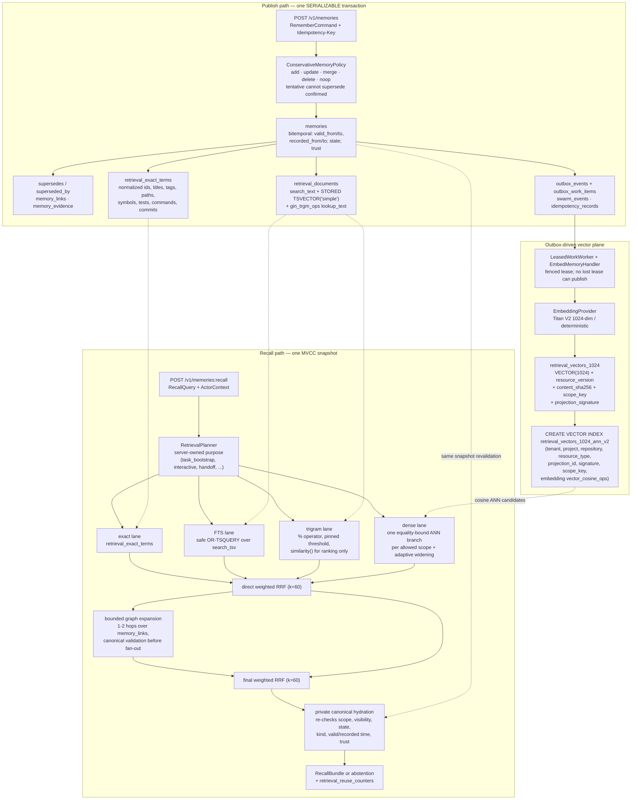

# Swarm Brain — submission architecture

Written 2026-08-07 for the CockroachDB × AWS Hackathon submission package.
This is the judge-facing overview. The engineering-level documents remain
[API contracts](../api.md), [CockroachDB schema](../cockroach-schema.md),
[retrieval status](../retrieval-status.md), and the executable
[schema.sql](../../src/swarmbrain/adapters/cockroach/schema.sql).

Every component named below exists in `src/swarmbrain/`. Nothing on these
diagrams is aspirational unless it carries a **(planned)** marker, and the
[what runs where](#what-runs-where-today) table states exactly what has been
executed and what has not.

## The idea in one paragraph

A swarm of heterogeneous coding agents — Claude Code, Codex CLI, Gemini CLI, a
local Qwen harness — works one repository together. Each harness speaks a
nine-tool stdio MCP bridge to one HTTP API (TLS `verify-full` to the database;
an HTTPS listener is pending a domain); every claim, checkpoint,
discovery, correction, conflict, and metric lands in CockroachDB. Two agents
never hold the same task, a dead agent's work is resumed by a different
vendor's agent from its last checkpoint, an unsupported claim cannot overwrite
an evidence-backed one, and recall fuses exact, full-text, trigram, dense-ANN,
and graph lanes over the same MVCC snapshot. The memory belongs to the swarm,
not to a model vendor or a process.

## 1. Swarm topology

```mermaid
flowchart LR
    subgraph Harnesses["Heterogeneous coding agents"]
        CC["Claude Code"]
        CX["Codex CLI"]
        GM["Gemini CLI"]
        QW["OpenCode / local Qwen"]
    end

    subgraph Bridges["Local stdio MCP bridges (swarmbrain-mcp)"]
        B1["transports/mcp/server.py\nnine model-visible tools\nruntime-owned lease renewal"]
    end

    subgraph Api["HTTP API (swarmbrain-api)"]
        H["transports/http/app.py\nFastAPI + strict Pydantic v2\nhealthz / readyz / error envelope"]
        AU["adapters/auth/tokens.py\nRunTokenCodec: signed short-lived\nrun-scoped bearer -> ActorContext"]
    end

    subgraph App["Application services"]
        CO["CoordinationService\nclaim / renew / release"]
        HO["HandoffService\ncheckpoint / complete"]
        ME["MemoryService\n+ ConservativeMemoryPolicy"]
        RE["RetrievalService\n+ RetrievalPlanner"]
        EV["EvidenceService"]
        CF["ConflictService"]
        EX["ExtractionService"]
        AD["AuditService"]
        DW["DurableWorkService"]
    end

    subgraph Ports["Typed async ports"]
        P["CoordinationStore · MemoryStore\nRetrievalGateway · GraphExpansionGateway\nCanonicalMemoryReader · EmbeddingProvider\nWorkQueueStore · OutboxStore · EventReader"]
    end

    subgraph Adapters["Storage adapters"]
        CK["adapters/cockroach/*\nCockroachDatabase pool\nCoordination / Memory / Retrieval\nDense / Graph / Work stores"]
        IM["adapters/memory/in_memory.py\nInMemoryKernel (tests, demo)"]
    end

    DB[("CockroachDB\ncanonical rows · retrieval projections\nVECTOR(1024) ANN · outbox · events")]

    subgraph Workers["Durable workers (swarmbrain-worker)"]
        WS["WorkerSupervisor"]
        LW["LeasedWorkWorker\nfenced outbox_work_items"]
        EW["ExtractionWorker"]
        EH["EmbedMemoryHandler"]
    end

    EMB["EmbeddingProvider\nDeterministic (local)\nBedrock Titan V2 (AWS)"]

    CC --> B1
    CX --> B1
    GM --> B1
    QW --> B1
    B1 -->|"run-scoped bearer token"| H
    H --> AU
    AU -->|"ActorContext + command"| App
    App --> Ports
    Ports --> CK
    Ports --> IM
    CK --> DB
    DB -->|"claim leased work"| WS
    WS --> LW
    WS --> EW
    LW --> EH
    EH --> EMB
    EH -->|"vector + projection + completion\nin one fenced transaction"| DB
```

Notes that matter for the judging criteria:

- The MCP tool schemas contain **no** tenant, project, repository, run, agent,
  or capability fields. Identity is derived from the authenticated token; a
  path or command identifier is a selector, and a mismatch is
  `403 scope_mismatch`, never a request to switch identity.
- There is exactly one write path into CockroachDB per concern, and every
  mutation is bound to an authenticated context plus an idempotency key.
- The worker plane never shares a transaction with the request plane. Remote
  side effects (embeddings) run outside the database transaction and are driven
  from the outbox, because a `40001` retry re-runs the whole closure.

## 2. Memory data flow

Three properties this diagram is drawn to make legible:

1. **The projections are never an authorization boundary.** Every lane query
   joins back to `memories` before `LIMIT`, and hydration re-checks every
   predicate. A stale or poisoned projection row cannot leak a memory.
2. **Supersession is append-only.** A correction inserts a new row, stamps
   `supersedes_id` / `superseded_by_id`, sets the previous row's `recorded_to`,
   and emits the event and outbox row in the same transaction. Ordinary recall
   selects `recorded_to IS NULL`; lineage keeps both versions forever.
3. **The vector plane is versioned.** Each `retrieval_vectors_1024` row carries
   the canonical resource version, content digest, and a
   `projection_signature` naming the renderer, mode, metric, normalization,
   truncation policy, model, and dimensions — so an old vector is never
   reinterpreted under a new model's semantics.

## What runs where today

As-built facts below are from the private deployment record
(deployed 2026-08-16, commit `e73ac97` — the deployed image is tagged
`swarm-brain:259faac`, that commit's pre-rewrite id; see the
[extraction map](../history/sen-extraction-map.md)).

| Layer | Today | On AWS |
| --- | --- | --- |
| `swarmbrain-api` (FastAPI) | Local process, `SWARMBRAIN_BACKEND=memory` or `cockroach` | ECS Fargate service `swarm-brain-api` (ARM64) behind an ALB in `us-east-1`, `smoke: PASSED` on the public URL |
| `swarmbrain-worker` | Local process against the same database | ECS Fargate service `swarm-brain-worker` (ARM64), no load balancer by design |
| `swarmbrain-mcp` stdio bridge | Local, one process per harness | Stays local by design; a real agent runs on the developer's machine |
| CockroachDB | Local single node (`v26.2.1` in the live test matrix) | CockroachDB Cloud `<cluster>` (Basic, `aws-us-east-1`, v26.2.5), schema v12 installed and verified |
| Embeddings | `DeterministicEmbeddingProvider` (local, reproducible) | `BedrockEmbeddingProvider` — Titan V2 1024-dim, exercised live 2026-08-16 with operator credentials and keyless via the ECS task role |
| Evidence artifacts | JSON under `evidence/` | No S3 export — not built; the task-role S3 grants were deliberately dropped |
| Secrets | Environment variables | Secrets Manager (DSN + token secret, suffix-pinned ARNs) |
| Logs / alarms | stdout | CloudWatch log groups, 7-day retention (budget alarm exists; service-health alarms do not yet) |
| Read-only console | `transports/http/console/` served at `GET /console` by `transports/http/app.py` | Live at `GET /console` on the ALB (HTTP — an HTTPS listener awaits a domain); URL published with the Devpost submission |

The distributed-resilience story (kill a node of a three-node cluster mid-run)
is a property of the transaction design, not of new code. It was rehearsed on
2026-08-07 with `scripts/resilience_demo.py` against the demo scenario of that
date: a **non-gateway** node of a local three-node cluster was SIGKILLed
mid-run during live writes, every beat finished on the surviving quorum, and
both survivors reported identical counts
(`evidence/*-node-kill-resilience.json`). The demo scenario has since been
reworked and the kill has not been re-rehearsed against the current beats;
gateway failover is not claimed.

## Verified behaviour behind these diagrams

- Full CockroachDB-backed suite: `1182 passed, 7 skipped` against a disposable
  CockroachDB 26.2.1 node (re-run 2026-08-17). The remaining skips are the
  absent pinned LongMemEval-V2 and GateMem external checkouts. The offline run
  is `1143 passed, 46 skipped` with no database or AWS needed (see
  [retrieval status](../retrieval-status.md)).
- Eight-beat scripted swarm demo (`uv run --extra serve swarmbrain-demo`)
  writes a named-check JSON artifact under `evidence/`; the captured run
  (`evidence/20260817T124623Z-swarm-demo.json`) stamps the CockroachDB backend
  in its execution provenance and has 4 agents across 4 vendors
  joining, all four racing the two ready Wave-A tasks for exactly 2 leases,
  cross-vendor recall, supersession with a rejected poisoning attempt, an
  idempotent replay, a cross-vendor crash handoff with stale-lease fencing, a
  two-wave DAG completing only after its evidence dependencies, and 26 durable
  swarm events.
- Live `EXPLAIN` assertions gate index selection for the FTS, trigram, ANN, and
  graph lanes; `EXPLAIN` proves index use and cannot prove ANN recall, which is
  why an exact-vector oracle forced through `retrieval_vectors_1024@primary`
  exists alongside it (see [retrieval evaluation](../retrieval-evaluation.md)).
